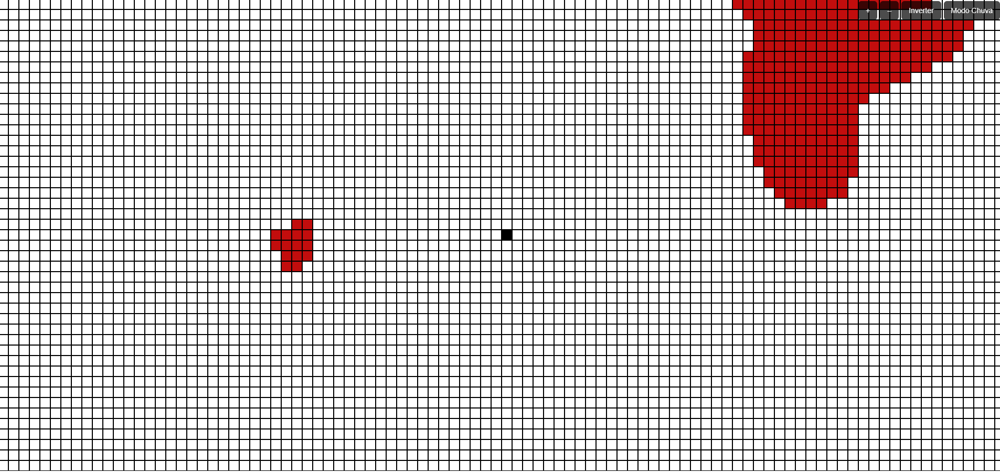

# 🧠 Tela de Amsler Responsiva + Modo Chuva (Rain Mode)

Uma ferramenta de **triagem visual interativa** desenvolvida para **diagnóstico rápido de distorções visuais**, como as causadas por **degeneração macular** ou sequelas de AVC.

## ✨ Funcionalidades

- ✅ **Grade responsiva** para marcação de distorções visuais  
- ✅ **Modo claro/escuro** com um clique (ou atalho `Ctrl + I`)  
- ✅ **Zoom in/out** com botões ou atalhos (`Ctrl + + / -`)  
- ✅ **Botão para apagar** toda a marcação (tecla `Espaço`)  
- ✅ **Modo Chuva (Rain Mode)**: Linhas verticais com 4 blocos de altura descem aleatoriamente, simulando estímulos visuais para diagnóstico funcional de áreas de perda de percepção  
- ✅ **Compartilhamento da marcação atual**: Gera uma URL com os quadrados preenchidos codificados para compartilhamento

## 🌐 Acesso

[Acesse a ferramenta em meu website!](https://rafaeloliveiradesign.com/tela-amsler/)

## 📸 Captura de Tela



> A tela se adapta automaticamente ao tamanho da janela e permite desenhar livremente clicando nas células.

## 🎮 Atalhos do Teclado

| Ação                    | Tecla                     |
|-------------------------|---------------------------|
| Aumentar zoom           | Ctrl + `+`                |
| Diminuir zoom           | Ctrl + `-`                |
| Inverter cores          | Ctrl + `I`                |
| Limpar marcações        | `Espaço`                  |
| Ativar/Desativar chuva  | Clique em `Rain Mode`     |

## ⚙️ Clonar e modificar

1. Clone o repositório:
   ```bash
   git clone https://github.com/seuusuario/tela-amsler-rainmode.git
   cd tela-amsler-rainmode
   ```

2. Abra o arquivo HTML diretamente no navegador:
   ```
   index.html
   ```

3. (Opcional) Suba num servidor local com VS Code Live Server ou Python:
   ```bash
   python -m http.server
   ```

## 💡 Motivação

Tive em AVC em Julho de 2024 e venho sofrendo com percas visuais.  
Essa ferramenta foi pensada para auxiliar no controle da perca visual e também para ajudar profissionais da saúde na triagem funcional de pacientes com distúrbios visuais, oferecendo estímulos precisos em tela cheia sem distrações.

## 🧑‍💻 Autor

Desenvolvido por [Rafael Oliveira](https://rafaeloliveiradesign.com)

---

© Rafael Oliveira - Licença livre para uso educacional e clínico.  
