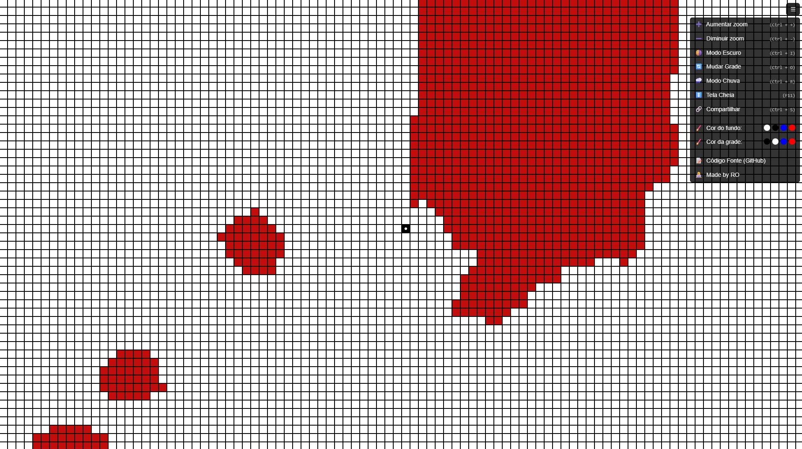

# 🧠 Tela de Amsler Responsiva + Modo Chuva (Rain Mode)

Uma ferramenta de **triagem visual interativa** desenvolvida para **diagnóstico rápido de distorções visuais**, como as causadas por **degeneração macular** ou sequelas de AVC.



## ✨ Funcionalidades

- ✅ **Grade responsiva** para marcação de distorções visuais
- ✅ **Modo claro/escuro** com um clique (ou atalho `Ctrl + I`)
- ✅ **Zoom in/out** com botões ou atalhos (`Ctrl + + / -`)
- ✅ **Botão para apagar** toda a marcação (tecla `Espaço`)
- ✅ **Modo Chuva (Rain Mode)**: Linhas verticais com 4 blocos de altura descem aleatoriamente, simulando estímulos visuais para diagnóstico funcional de áreas de perda de percepção (`Ctrl + R`)
- ✅ **Compartilhamento**: Gera uma URL com os quadrados preenchidos codificados para compartilhamento, **incluindo agora as células piscando e a posição personalizada do ponto central**.
- ✅ **Ponto central personalizável**: Mova o ponto central para qualquer quadrado da grade segurando `Shift` e clicando na nova posição.
- ✅ **Células piscando**: Marque células individuais para piscar segurando `Ctrl` e clicando nelas.
- ✅ **Cores customizáveis**: Selecione as cores de fundo e grade utilizando os presets no menu

## 🌐 Acesso

[Acesse a ferramenta em meu website\!](https://rafaeloliveiradesign.com/tela-amsler/)

## 📸 Captura de Tela

> A tela se adapta automaticamente ao tamanho da janela e permite desenhar livremente clicando nas células.

## 🎮 Atalhos do Teclado

| Ação                       | Tecla                      |
| :------------------------- | :------------------------- |
| Aumentar zoom              | `Ctrl` + `+`               |
| Diminuir zoom              | `Ctrl` + `-`               |
| Alternar Tema              | `Ctrl` + `I`               |
| Mudar Grade                | `Ctrl` + `O`               |
| Ativar/Desativar chuva     | `Ctrl` + `R`               |
| Tela Cheia                 | `F11`                      |
| Limpar marcações           | `Espaço`                   |
| Tela Cheia                 | `F11`                      |
| Resetar                    | `Ctrl` + `Backspace`       |
| Compartilhar grade         | `Ctrl` + `S`               |
| **Mover ponto central**    | `Ctrl` + clique na célula  |
| **Marcar célula piscando** | `Shift` + clique na célula |
| **Adicionar Nota**         | Duplo clique na célula     |

## ⚙️ Clonar e modificar

1.  Clone o repositório e compile os assets:

    ```bash
    git clone git@github.com:RafaelOlivra/tela-amsler-rafael-oliveira.git
    cd tela-amsler-rafael-oliveira
    bash ./build.sh
    ```

    \*Você pode passar a flag `--watch` para compilar os assets conforme os arquivos são modificados.

2.  Abra o arquivo HTML diretamente no navegador:

    ```
    ./dist/index.html
    ```

## ⚙️ Build System com `.env`

O projeto possui um **sistema de build baseado em Bash** que:

- Compila SCSS em CSS minificado (`dist/style.css`)
- Minifica e bundleia o JS (`dist/script.min.js`)
- Gera dinamicamente o `index.html` a partir do `index-source.html`
- Substitui **placeholders** com variáveis definidas em `.env`:

```env
TITLE='Tela de Amsler Responsiva | Rafael Oliveira'
DESCRIPTION='Tela de Amsler — Ferramenta de triagem visual em tela cheia.'
LANGUAGE_CODE='pt-BR'
FAVICON_URL='./favicon.ico'

HEAD_SCRIPTS=''
MENU_EXTRA_ITEMS=''

# Traduções para UI (opcional)
TRANSLATION_MAP='
Alternar Tema||
Aumentar zoom||
Compartilhar||
...'
```

- Atualiza **traduções e scripts extras** automaticamente no HTML
- Suporta **modo watch** (`--watch`) para recompilar SCSS, JS e HTML ao salvar alterações

## 💡 Motivação

Tive um AVC em Julho de 2024 e venho sofrendo com perdas visuais. Essa ferramenta foi pensada para auxiliar no controle da perda visual e também para ajudar profissionais da saúde na triagem funcional de pacientes com distúrbios visuais, oferecendo estímulos precisos em tela cheia sem distrações.

## 🧑‍💻 Autor

Desenvolvido por [Rafael Oliveira](https://rafaeloliveiradesign.com)

---

© Rafael Oliveira - Licença livre para uso educacional e clínico.
